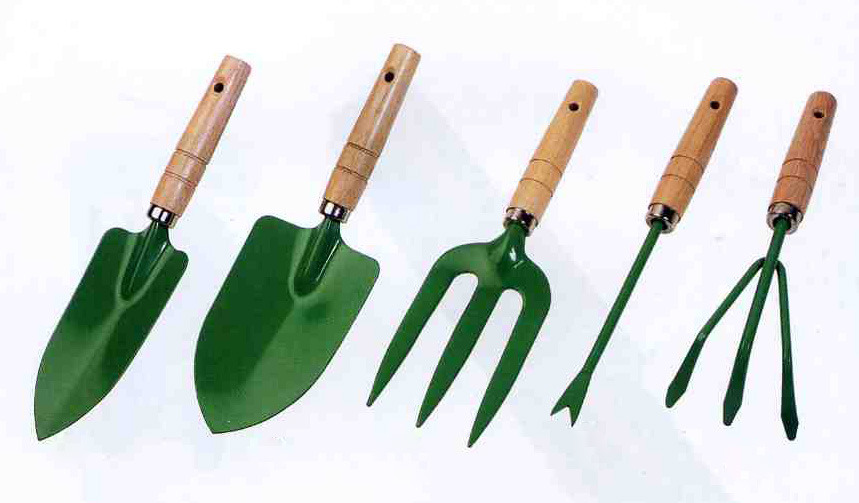
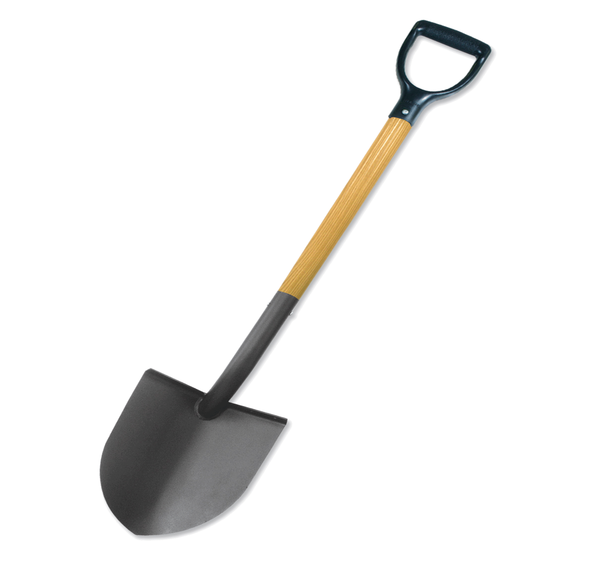
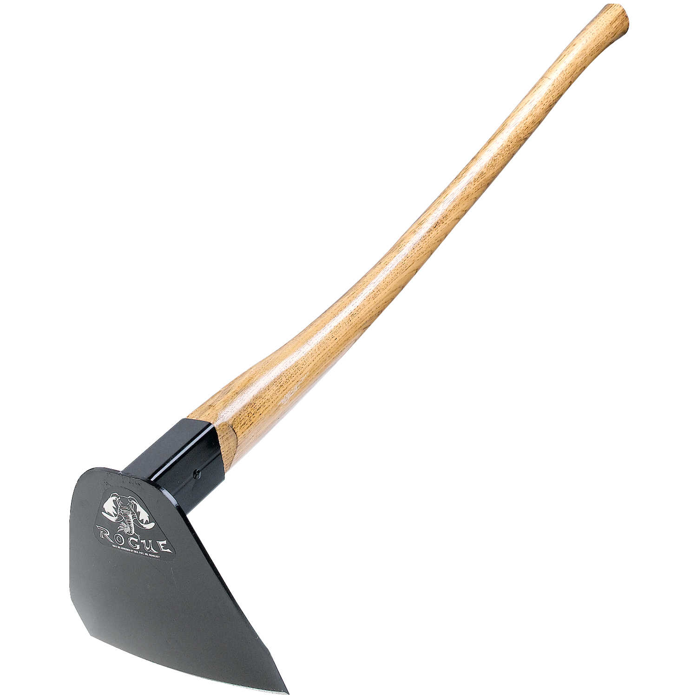
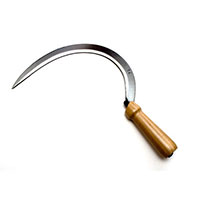
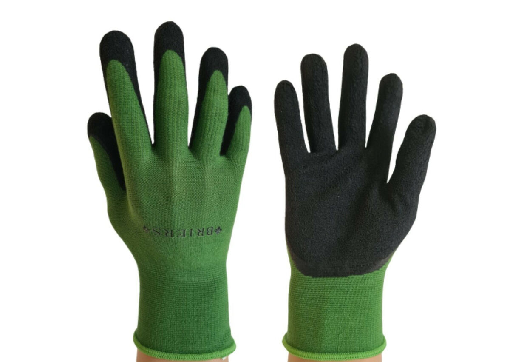
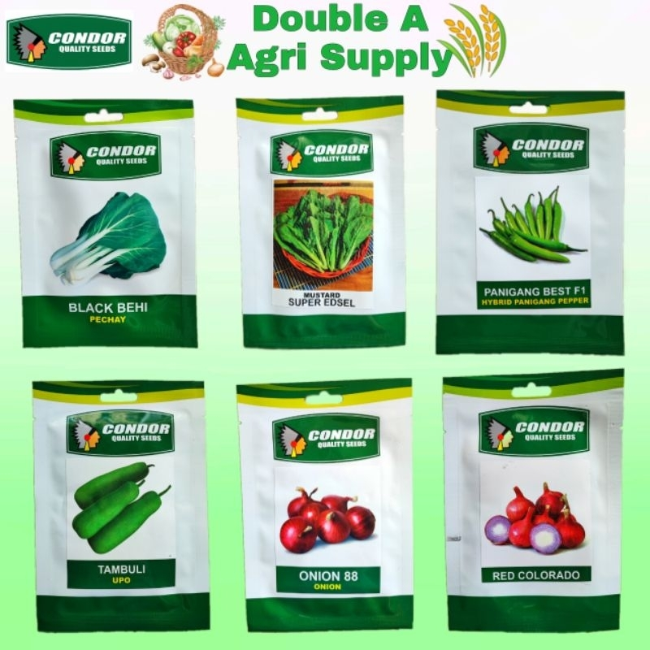
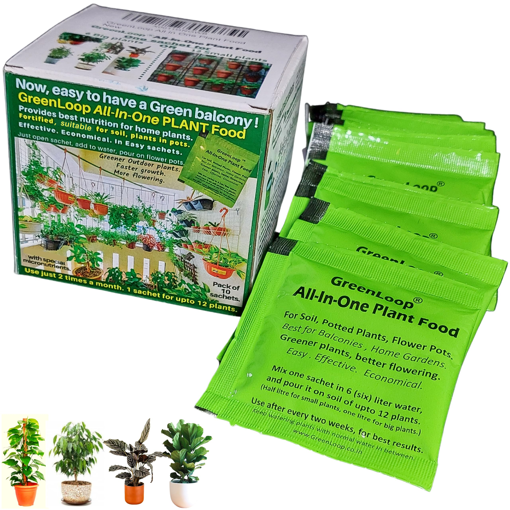
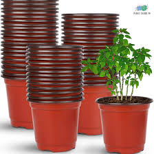

<!DOCTYPE html>
<html lang="en">
<head>
    <meta charset="UTF-8">
    <meta name="viewport" content="width=device-width, initial-scale=1.0">
    <title>AgriFarm - E-commerce Landing Page</title>
    <link rel="stylesheet" href="style.css">
</head>
<body>

<!-- Header Section -->
<header>
    
AgriFarm Supplies

    <nav>
        <ul>
            <li><a href="#home">Home</a></li>
            <li><a href="#products">Products</a></li>
            <li><a href="#about">About</a></li>
            <li><a href="#contact">Contact</a></li>
        </ul>
    </nav>
    <input type="text" id="searchBox" placeholder="Search products..." onkeyup="searchProducts()">
    <ul id="productList">
        <li>Tools</li>
        <li>Seeds</li>
        <li>Fertilizers</li>
        <li>Pots</li>
    </ul>
</header>

<!-- Home Section -->
<section id="home" class="banner">
    <h1>Find Your Perfect Product</h1>
    
Exclusive deals just for you

    <button class="cta-btn">Shop Now</button>
</section>

<!-- Products Section -->
<section id="products" class="featured-products">
    

        
        <h3>Gardening Tool Set</h3>
        
$23.99

        <button onclick="addToCart('Gardening Tool Set', 23.99)">Add to Cart</button>
    

    

        
        <h3>Gardening Fork</h3>
        
$19.99

        <button onclick="addToCart('Gardening Fork', 19.99)">Add to Cart</button>
    

    

        
        <h3>Shovel</h3>
        
$27.99

        <button onclick="addToCart('Shovel', 27.99)">Add to Cart</button>
    

    

        
        <h3>Hoe</h3>
        
$29.99

        <button onclick="addToCart('Hoe', 29.99)">Add to Cart</button>
    

    

        
        <h3>Sickle</h3>
        
$14.99

        <button onclick="addToCart('Sickle', 14.99)">Add to Cart</button>
    

    

        
        <h3>Pruning Shears</h3>
        
$24.99

        <button onclick="addToCart('Pruning Shears', 24.99)">Add to Cart</button>
    

    

        
        <h3>Hedge Shears</h3>
        
$32.99

        <button onclick="addToCart('Hedge Shears', 32.99)">Add to Cart</button>
    

    

        
        <h3>Gloves</h3>
        
$10.99

        <button onclick="addToCart('Gloves', 10.99)">Add to Cart</button>
    

    

        
        <h3>Gloves</h3>
        
$15.99

        <button onclick="addToCart('Seeds', 15.99)">Add to Cart</button>
    

    

        
        <h3>Fertilizers</h3>
        
$20.99

        <button onclick="addToCart('Fertilizers', 20.99)">Add to Cart</button>
    

    

        
        <h3>Pots</h3>
        
$12.99

        <button onclick="addToCart('Seeds', 12.99)">Add to Cart</button>
    

</section>

<!-- About Section -->
<section id="about">
    <h2>About AgriFarm</h2>
    
  Welcome to AgriFarm Supplies, your one-stop online store for all agricultural and farming needs. We are dedicated to providing high-quality farming products, tools, and supplies to help farmers, gardeners, and agricultural businesses thrive.  
        At AgriFarm Supplies, we understand the importance of reliable and affordable farming essentials. That’s why we offer a wide range of products, including seeds, fertilizers, pesticides, farming tools, irrigation equipment, and much more—all sourced from trusted suppliers.  
        Our mission is to support the agricultural community by making farm supplies easily accessible through a seamless online shopping experience. With user-friendly navigation, secure payment options, and fast delivery, we ensure that you get what you need, when you need it.  
        Whether you're a small-scale farmer, a large agricultural enterprise, or a gardening enthusiast, AgriFarm Supplies is here to serve you with quality products and exceptional customer service.  
        Grow More. Harvest Better. Shop Smarter—Only at AgriFarm Supplies!

</section>

<!-- Contact Section -->
<section id="contact">
    <h2>Contact Us</h2>
    
Contact us at: <a href="mailto:support@AgriFarm.com">support@AgriFarm.com</a> | 123-456-7890 

    
Follow us:
        <a href="#">FB</a> | <a href="#">IG</a> | <a href="#">TW</a>
    

</section>

<!-- Footer Section -->
<footer>
    
<a href="#">Terms & Conditions</a> | <a href="#">Privacy Policy</a>

</footer>

</body>
</html>
